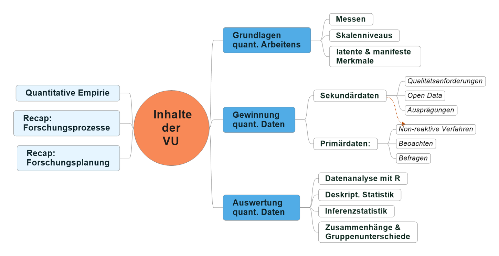

# Ouvertüre (aka "Syllabus") {#syllabus}

1955 legte John Langshaw Austin die Grundlagen für die Theorie der Sprechakte. Sprache fungiert dabei als Brücke zwischen den Gegenständen und Prozessen der Welt und den ihnen beigemessenen Bedeutungen. Zugleich dient Sprache dazu Sprechhandlungen -- Fragen, Gebote oder Bitten -- zu setzen, welche wiederum bestimmte Wirkungen bei der Hörer- und/oder Leserschaft hervorrufen sollen.

Der Konnex zu einer Lehrveranstaltung über quantitative Methoden ist ein bemerkenswert kurzer: Einerseits stehen quantitative Daten niemals 'für sich', sondern werden stets interpretiert und damit letztlich versprachlicht. Auf der anderen Seite folgt die humangeographische Nutzung von Daten den von Austin beschriebenen Stufen: Wir erzeugen und interpretieren empirische Daten zu geographischen Erkenntnisobjekten anhand methodologischer Grundsätze. Diese Zahlen bilden damit die Brücke zwischen dem Erkenntnisobjekt und seiner Bedeutung. Danach nutzen wir diese Daten für wissenschaftliche Aussagen über geographische Erkenntnisobjekte, mit dem wir Effekte -- üblicherweise Überzeugung -- bewirken wollen. Kurz und gut: Eine Diskussion quantitativer Forschungsmethoden kann immer auch als ein Nachdenken über 'Doing Things with Numbers' verstanden werden - 👍.

Dieses Nachdenken über die quantitative Konstruktion geographischer Empirie steht im Zentrum der Lehrveranstaltung. Dazu werden folgende Themen behandelt:

{.videoframe .fullscreen-enabled}

Als Einstieg werden ausgewählte geographische Forschungsprozesse samt deren zugrundeliegenden Erkenntnisinteressen diskutiert. Nach der Behandlung von Gütekriterien quantitativen Forschens werden zentrale humangeographische Methoden zur quantitativen Datenerfassung (z. B. Kartierung, Zählung und Befragung) vorgestellt. Danach werden ausgewählte statistische Verfahren zur Beschreibung von Variablen, Zusammenhängen zwischen diesen und Gruppenunterschieden behandelt und praktisch erprobt.

## Lernziele

Der Besuch der Lehrveranstaltung sollte Sie in die Lage versetzen:

-   die Stellung quantitativer Methoden in unterschiedlichen Forschungsprozessen zu verstehen;
-   Unterschiede bezüglich Voraussetzungen, Vorbereitung, Umsetzung und Nachbereitung von ausgewählten quantitativen Methoden zu kennen;
-   die Bedeutsamkeit von Skalenniveaus für die Erhebung und Analyse quantitativer Daten darzulegen;
-   selbständig die Operationalisierung latenter Merkmalsausprägungen umzusetzen;
-   selbständig ausgewählte Methoden zur quantitativen Datenerhebung vorzubereiten und anzuwenden;
-   die Eignung unterschiedlicher statistischer Auswertemethoden zur Beantwortung von Untersuchungsfragen zu beurteilen;
-   selbständig quantitative Datensätze deskriptiv auszuwerten, um Untersuchungsfragen zu beantworten.

## Zeitplanung

+----------+------------+--------------------------------------+-----------------------------------------------------------------------------------------------------+
| EH       | Tag        | Uhrzeit & Ort                        | Thema                                                                                               |
+==========+============+======================================+=====================================================================================================+
| 1        | 16.03.2022 | 13.45 - 16.00 \@ EDV-Raum Geographie | **Quantitative Empirie:** Überblick auf Forschungsprozesse, Ablauf empirisch-quantiativen Forschens |
+----------+------------+--------------------------------------+-----------------------------------------------------------------------------------------------------+
| 2        | 23.03.2022 | 13.45 - 16.00 \@ EDV-Raum Geographie | **quant. Daten erzeugen** (Messen & Skalen) & **gewinnen** (Primär- & Sekundärdaten)                |
+----------+------------+--------------------------------------+-----------------------------------------------------------------------------------------------------+
| 3        | 30.03.2022 | 13.45 - 16.00 \@ EDV-Raum Geographie | Die **Datengewinnung**:\                                                                            |
|          |            |                                      | Möglichkeiten der Primär- und Sekundärdatengewinnung                                                |
+----------+------------+--------------------------------------+-----------------------------------------------------------------------------------------------------+
| 4        | 06.04.2022 | 13.45 - 16.00 \@ EDV-Raum Geographie | Vertiefung **Primärdatengewinnung 1:**\                                                             |
|          |            |                                      | Die Befragungsplattform Limesurvey                                                                  |
+----------+------------+--------------------------------------+-----------------------------------------------------------------------------------------------------+
| 5        | 27.04.2022 | 13.45 - 16.00 \@ EDV-Raum Geographie | Vertiefung **Primärdatengewinnung 2:**\                                                             |
|          |            |                                      | Die Stichprobenziehung                                                                              |
+----------+------------+--------------------------------------+-----------------------------------------------------------------------------------------------------+
| 6        | 04.05.2022 | 13.45 - 16.00 \@ EDV-Raum Geographie | Die **Hilfsmittel R & RStudio**:\                                                                   |
|          |            |                                      | Logik, Datentypen, Dataframes, Im- & Export                                                         |
+----------+------------+--------------------------------------+-----------------------------------------------------------------------------------------------------+
| 7        | 11.05.2022 | 13.45 - 16.00 \@ EDV-Raum Geographie | Puffereinheit                                                                                       |
+----------+------------+--------------------------------------+-----------------------------------------------------------------------------------------------------+
| 8        | 18.05.2022 | 13.45 - 16.00 \@ EDV-Raum Geographie | **Häufigkeitsanalyse kategorialer Daten:**\                                                         |
|          |            |                                      | numerische & graphische Möglichkeiten                                                               |
+----------+------------+--------------------------------------+-----------------------------------------------------------------------------------------------------+
| 9        | 25.05.2022 | 13.45 - 16.00 \@ EDV-Raum Geographie | **Zusammenhänge** zwischen **kategorialen Variablen**                                               |
+----------+------------+--------------------------------------+-----------------------------------------------------------------------------------------------------+
| 10       | 01.06.2022 | 13.45 - 16.00 \@ EDV-Raum Geographie | **Beschreibung metrischer Variablen**                                                               |
+----------+------------+--------------------------------------+-----------------------------------------------------------------------------------------------------+
| 11       | 10.06.2022 | 08.30 - 10.45 \@ EDV-Raum Geographie | **Zusammenhänge** zwischen **metrischen Variablen**                                                 |
+----------+------------+--------------------------------------+-----------------------------------------------------------------------------------------------------+
| 12       | 15.06.2022 | 13.45 - 16.00 \@ EDV-Raum Geographie | **Zusammenhänge** zwischen **metrischen Variablen**                                                 |
+----------+------------+--------------------------------------+-----------------------------------------------------------------------------------------------------+
| 13       | 22.06.2022 | 13.45 - 16.00 \@ EDV-Raum Geographie | **Gruppenunterschiede:**\                                                                           |
|          |            |                                      | Überblick Maße, Beispiele                                                                           |
+----------+------------+--------------------------------------+-----------------------------------------------------------------------------------------------------+
| 14       | 29.06.2022 | 13.45 - 16.00 \@ EDV-Raum Geographie | **Gruppenunterschiede:**\                                                                           |
|          |            |                                      | Überblick Maße, Beispiele                                                                           |
+----------+------------+--------------------------------------+-----------------------------------------------------------------------------------------------------+

## Rulez of the Game

-   VU mit **Anwesenheitspflicht**
-   Bitte beachten Sie die Inhalte der VO/UE/VU 'Einführung in das wissenschaftliche Arbeiten'!
-   Selber lesen macht satt!
-   **Deadlines sind Deadlines** sind Deadlines\
    👉 „Kane G´schichtln"

## Übungsteile

\@Home1 bis \@Home4:

-   In **2er Gruppen**:\
    👉 Gruppeneinteilung via OLAT
-   Jeweils **min. 4**
-   Schriftl. Ausarbeitung

## Bewertungskriterien

-   Übungsteile: 65 %
-   Allgemeine Mitarbeit: 35 %

## Formelles zu den Übungsarbeiten

Im Rahmen der VU sind sämtliche bisher behandelten Anforderungen an wissenschaftliches Arbeiten zu beachten. Bitte ziehen Sie in Zweifelsfällen die Unterlagen aus den LVAs zur Einführung in das wissenschaftliche Arbeiten heran.

Folgende Kriterien sind bei der Erstellung schriftlicher Ausarbeitungen besonders zu beachten:

-   Vollständiges Titelblatt (LVA-Nr. & Titel, Semester, Titel der Arbeit, Namen und Matrikelnummern etc.);
-   Formal korrektes Inhaltsverzeichnis inkl. Seitenzahlen und Seitennummerierung auf allen Seiten;
-   Integration grundlegender Literatur zum Thema in die eigene Argumentation;
-   Korrektes, einheitliches Zitieren;
-   Vollständiges, alphabetisch sortiertes Literaturverzeichnis;
-   Wissenschaftlicher, gendergerechter Schreibstil;
-   Orthographische Korrektheit der abgegebenen Texte (Rectschreipfähler, Zeichensetzung etc.).

## Empfehlung zur eingesetzten Software

Zur Vorbereitung auf die praktischen Übungseinheiten empfiehlt es sich, die Software R und RStudio lokal zu installieren. Eine gelungene Anleitung dazu bieten die [R-Psychos](https://r-intro.tadaa-data.de/book/) Lukas Burk und Tobias Anton:

<https://r-intro.tadaa-data.de/book/installation.html>

> 👉 **Tipp:** Neugierige finden dort auch eine kurze Erklärung wer oder was R denn überhaupt ist.

## Ausgewählte Hilfestellungen zum Thema R und RStudio

-   Lukas Burks und Tobias Antons **"R für Psychos"**: <https://r-intro.tadaa-data.de/book/>
-   Walter Grubers **"Reinführung in RStudio"** (= bester Titel ever): <https://wgruber.github.io/R-Intro>
-   Hadleyx Wickhams und Garrett Grolemungs **"R for Data Science"**: <https://r4ds.had.co.nz>
-   Yan Holtzs **"R Graph Gallery"**: <https://www.r-graph-gallery.com>

## Literatur zur Lehrveranstaltung {#literatur}

-   Bortz, J. und Döring, N. (2009): Forschungsmethoden und Evaluation für Human- und Sozialwissenschaftler. Heidelberg, Springer.
-   Groß, Jürgen (2010): Grundlegende Statistik mit R. Eine anwendungsorientierte Einführung in die Verwendung der Statistik Software R. Wiesbaden: Vieweg+Teubner Verlag / GWV Fachverlage GmbH Wiesbaden. Online verfügbar unter <http://dx.doi.org/10.1007/978-3-8348-9677-3>.
-   Kromrey, H. und Strübing, J. (2009): Empirische Sozialforschung: Modelle und Methoden der standardisierten Datenerhebung und Datenauswertung. Stuttgart, Lucius & Lucius.
-   Kuckartz, U.; Rädiker, S.; Ebert, T. und Schehl, J. (2010): Statistik. Eine verständliche Einführung. 1. Aufl., Bielefeld, VS Verlag.
-   Müller-Benedict, V. (2011): Grundkurs Statistik in Den Sozialwissenschaften. Wiesbaden, VS Verlag.
-   Reuber, P.; Pfaffenbach, C. und Mattissek, A. (2013): Methoden Der Empirischen Humangeographie. Braunschweig, Westermann.
-   Thulin, M.: Modern Statistics with R. Online: <http://www.modernstatisticswithr.com/> [zuletzt geprüft am 25.11.2021].
