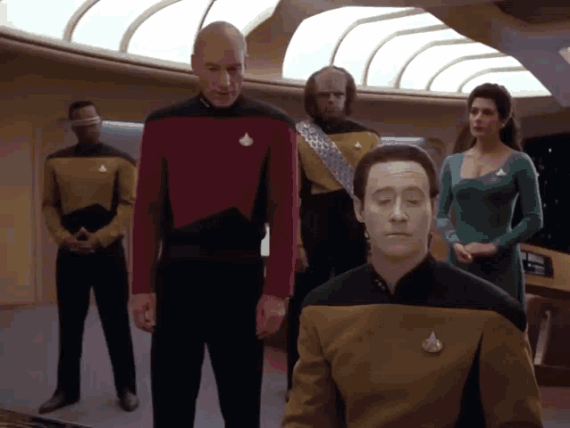

# Wege zum empirischen Forschen

## 📢 Zielsetzung dieser Einheit {.unnumbered}

Ausgangspunkt dieser Einheit bildet die Wiederholung klassischer Ziele empirischen Forschens. Dazu werden die unterschiedlichen Schritte eines Forschungsprozesses und abschließend die Gütekriterien quantativen Forschens behandelt.

------------------------------------------------------------------------

## Wozu Empirie?

Eigentlich recht einfach 🧐 :

Neben der Theorie bildet die Empirie das zweite Standbein der Geographie, um Mensch-Technik-Umwelt Beziehungen zu erschließen. Empirie bildet somit eine klare Gegenposition zu einer "Geography of the Armchair":

```{r echo=FALSE}
mySlideshow <- "eh2_latente-merkmale-messen_v1"
mySlideWidth <- 600
mySlideHeight <- 450

knitr::asis_output(paste(
  "<iframe src=\"https://kamihoeferl.at/lehre/vu_sozwiss_1/___slides/",
  mySlideshow,
  ".html#1\" width=\"",
  mySlideWidth,
  "px\" height=\"",
  mySlideHeight,
  "px\" class=\"videoframe\" allowfullscreen>Your browser doesnot support iframes <a href=\"<https://kamihoeferl.at/lehre/vu_sozwiss_1/___slides/",
  mySlideshow,
  ".html#1\">click here to view the page directly.</a></iframe>", sep = ""))
knitr::asis_output(paste(
  "<div><a href=\"https://kamihoeferl.at/lehre/vu_sozwiss_1/___slides/",
  mySlideshow,
  ".pdf\">Die Slides als PDF</a></div>",
  sep = ""))
```

## Aber wie?

Wie genau wir nun aber ins empirische Forschen kommen, kann uns diese Gegenposition jedoch noch nicht erklären. Dazu müssen wir einen Blick auf die unterschiedlichen Phasen eines empirischen Forschungsprozesses werfen:

```{r echo=FALSE}
mySlideshow <- "eh1_forschungsprozess_v1"
mySlideWidth <- 600
mySlideHeight <- 450

knitr::asis_output(paste(
  "<iframe src=\"https://kamihoeferl.at/lehre/vu_sozwiss_1/___slides/",
  mySlideshow,
  ".html#1\" width=\"",
  mySlideWidth,
  "px\" height=\"",
  mySlideHeight,
  "px\" class=\"videoframe\" allowfullscreen>Your browser doesnot support iframes <a href=\"<https://kamihoeferl.at/lehre/vu_sozwiss_1/___slides/",
  mySlideshow,
  ".html#1\">click here to view the page directly.</a></iframe>", sep = ""))
knitr::asis_output(paste(
  "<div><a href=\"https://kamihoeferl.at/lehre/vu_sozwiss_1/___slides/",
  mySlideshow,
  ".pdf\">Die Slides als PDF</a></div>",
  sep = ""))
```

## Hauptsache Daten?

Um sicher gehen zu können, dass sich der ganze Aufwand empirischen Arbeitens auch lohnt - also belastbare Antworten auf unsere Untersuchungsfragen gefunden werden - müssen wir Gütekriterien einhalten. Welche dies sind, wollen wir hier kurz erörtern:


```{r echo=FALSE}
mySlideshow <- "eh1_guetekriterien_v1"
mySlideWidth <- 600
mySlideHeight <- 450

knitr::asis_output(paste(
  "<iframe src=\"https://kamihoeferl.at/lehre/vu_sozwiss_1/___slides/",
  mySlideshow,
  ".html#1\" width=\"",
  mySlideWidth,
  "px\" height=\"",
  mySlideHeight,
  "px\" class=\"videoframe\" allowfullscreen>Your browser doesnot support iframes <a href=\"<https://kamihoeferl.at/lehre/vu_sozwiss_1/___slides/",
  mySlideshow,
  ".html#1\">click here to view the page directly.</a></iframe>", sep = ""))
knitr::asis_output(paste(
  "<div><a href=\"https://kamihoeferl.at/lehre/vu_sozwiss_1/___slides/",
  mySlideshow,
  ".pdf\">Die Slides als PDF</a></div>",
  sep = ""))
```

------------------------------------------------------------------------

🏆 **Nun wissen wir, ...**

- ... dass wir empirisch **unterschiedliche Untersuchungsziele** verfolgen können:
- ... dass neben dem Erarbeiten der Untersuchungsfragen die **Datengewinnung und -analyse** sowie die **Ergebnispräsentation und Archivierung der Erkenntnisse und Daten** wichtige Schritte empirischen Arbeitens sind.
- ... dass wir bei all diesen Schritten **Entscheidungen, Vorgehensweisen und Methoden reflektieren, begründen und dokumentieren** müssen.


Oh, wait ... there is more ...

{.videoframe width="250"}

