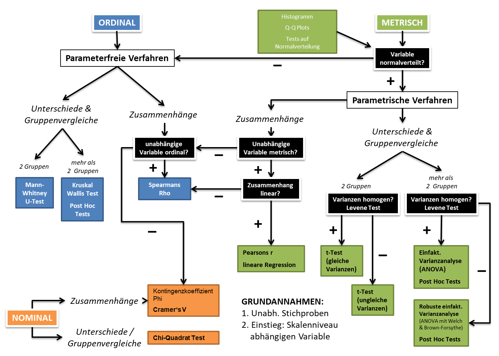

# Zusammenhänge zwischen kategorialen Variablen {#zusammenhaenge-kategorial}

## 📢 Zielsetzung dieser Einheit {.unnumbered}

In dieser Einheit wollen wir uns den Zusammenhängen zwischen kategorialen (genauer gesagt: nominalen) Variablen widmen. Wir nutzen dazu das Beispiel der vorigen Einheit \@ref(#haeufigkeit-kategorial) zur Wahrnehmung der COVID-19 Pandemie. Anhand dieses Beispiels werden wir

-   prinzipielle **Möglichkeiten zur Messung von Zusammenhängen** zwischen zwei nominalen Variablen besprechen;
-   uns ansehen, wie wir das Vorhandensein von Zusammenhängen mittels **Chi-Quadrat-Test** auf Unabhängigkeit und das Messen der Stärke solcher Zusammenhänge mittels **Cramers V** praktisch umsetzen können.

```{r echo=FALSE, purl=FALSE}
myScriptname <- "08_zusammenhaenge_kategoriale_variablen"

knitr::asis_output(paste(
  "<p><strong>tl;dr: </strong>",
  "<a href=\"https://kamihoeferl.at/lehre/vu_sozwiss_1/",
  myScriptname,
  ".R\" type=\"application/octet-stream\">Her mit dem Code!</a></p>",
  sep = ""))
```

------------------------------------------------------------------------

## Die Ausgangslage

Wir nutzen erneut die vom Presse- und Informationsamt der Deutschen Bundesregierung erstellte Bevölkerungsbefragung zum Thema "Corona-Krise" (vgl. Kapitel \@ref(katdatasetup)). Konkret interessieren wir uns für den Zusammenhang zwischen folgenden zwei Variablen:

-   **Frage Nr. 5: Die beurteilte Angemessenheit der Maßnahmen zur Pandemiebekämpfung**\
    Wie schätzen Sie die aktuellen politischen Maßnahmen ein, um das Corona-Virus einzudämmen: Sind diese getroffenen Maßnahmen Ihrer Meinung nach angemessen, gehen sie zu weit oder gehen sie nicht weit genug?

-   **Frage s8: Die Politische Orientierung**\
    Diese Frage zielt auf das Wahlverhalten der befragten Person der letzten Bundestagswahl ab.

Als vorbereitenden Schritt laden wir somit die zunächst die Befragungsergebnisse und führen die in Kapitel \@ref(katdatamanipul) beschriebenen Manipulationen (laufende "ID" vergeben & Skalenniveaus setzen) aus:

```{r message=FALSE, warning=FALSE}
library(tidyverse)

Trendfragen <- read.csv2("data/Trendfragen_Corona_45-20/ZA7677_v1-0-0.csv", encoding = "UTF-8") %>%
  as_tibble(.) %>%
  mutate(id = row_number())
TrendRedux <- Trendfragen %>%
  select(id, bcor5, s8) %>%
  mutate(bcor5 = as.factor(bcor5), s8 = as.factor(s8)) %>%
  filter(s8 != "-1") %>%
  mutate(s8 = droplevels(s8))  
```

Nach der tabellarischen und graphischen Auseinandersetzung mit der **Beziehung zwischen der politischen Ausrichtung (bcor 5) und der Beurteilung der Maßnahmen zur Pandemiebekämpfung (s8)** (vgl. Kapitel \@ref(katdatabivarn)) können wir sagen:

Ja, vermutlich stehen diese beiden Merkmale zueinander in Beziehung. Am deutlichsten sieht man dies wohl bei den Befragten die sich politisch zur AfD bekennen und fast zur Hälfte die gesetzten Maßnahmen als zu weitreichend interpretieren. Wie man das am besten sehen kann? Am einfachsten mit einer **Kontingenztabelle**:

```{r}
n.table <- table(TrendRedux$bcor5, TrendRedux$s8)
prop.table(n.table, 2) %>%
  round(., 2) %>%
  knitr::kable()
```

## Zusammenhänge zwischen zwei kategorialen Variablen messen - die Theorie

Am Ende der letzten Einheit (vgl. Kapitel \@ref(katdatabivarn)) konnten wir bereits ein qualitatives Verständnis der Beziehung zwischen zwei kategorialen Variablen erlangen. Wie wir **systematisch Beziehungen zwischen zwei kategorialen Variablen** numerisch und graphisch erkunden können, wollen wir uns nun etwas genauer ansehen:

```{r echo=FALSE}
mySlideshow <- "eh9-1_zusammenhangsmasse_nominal_v2"
mySlideWidth <- 600
mySlideHeight <- 450

knitr::asis_output(paste(
  "<iframe src=\"https://kamihoeferl.at/lehre/vu_sozwiss_1/___slides/",
  mySlideshow,
  ".html#1\" width=\"",
  mySlideWidth,
  "px\" height=\"",
  mySlideHeight,
  "px\" class=\"videoframe\" allowfullscreen>Your browser doesnot support iframes <a href=\"<https://kamihoeferl.at/lehre/vu_sozwiss_1/___slides/",
  mySlideshow,
  ".html#1\">click here to view the page directly.</a></iframe>", sep = ""))
knitr::asis_output(paste(
  "<div><a href=\"https://kamihoeferl.at/lehre/vu_sozwiss_1/___slides/",
  mySlideshow,
  ".pdf\">Die Slides als PDF</a></div><br>",
  sep = ""))
```

Wie können wir nun also auf einfache Art und Weise überprüfen, ob zwischen der politischen Orientierung und der eingeschätzten Angemessenheit der Maßnahmen zur Pandemiebekämpfung ein (wie auch immer gearteter) Zusammenhang besteht?

Werfen wir dazu einen Blick auf unseren Schummler:

```{r out.width=600,  echo=FALSE, fig.cap="Auswerteverfahren für unabhängige Stichproben (Quelle: Eigene Überarbeitung 2016 von [Hager, 2011](https://www.univie.ac.at/soziologie-statistik/lingu/master/Signifikanztests.pdf))", out.extra = "class = 'videoframe fullscreen-enabled'"}

```

Da wir ja den Zusammenhang zwischen einer nominalen und einer ordinalen Variable erkunden wollen, landen wir in der linken unteren Ecke unseres Schummlers: Wir können damit

-   das **Vorhandensein eines Zusammenhangs** zwischen unseren Variablen mittels eines Chi-Quadrat-Test auf Unabhängigkeit überprüfen;

-   und sollte ein solcher Zusammenhang gegeben sein:

    -   diesen anhand der Pearson Residuen **qualitativ besser verstehen**;

    -   dessen **Stärke** mittels Cramers V messen.

## Überprüfung des Zusammenhangs zwischen politischer Orientierung und Angemessenheit des Pandemiemanagements

Um diesen vermuteten Zusammenhang eindeutig zu belegen, greifen wir also auf den [**Chi-Quadrat-Test nach Pearson**](https://www.methodenberatung.uzh.ch/de/datenanalyse_spss/zusammenhaenge/pearsonzush.html) zurück.

Um in R einen **Chi-Quadrat-Test** durchzuführen, schreiben wir:

```{r}
chi <- chisq.test(n.table)
chi
```

Warum werden wir darauf hingewiesen, dass der Test ev. **"incorrect"** sei? Weil einige der **Zellen** unserer Kontingenztabelle mit **weniger als 5 Beobachtungen** besetzt sind:

```{r}
n.table %>%
  knitr::kable()
```

Da wir diese Annahme nicht einhalten können, sollten wir:

-   Die **Anzahl der Beobachtungseinheiten erhöhen**, um so den geforderten Mindestbesatz von 5 Beobachtungen je Zelle zu überspringen. In unserem Fall ist das aber nicht möglich.

-   Versuchen, durch das **Zusammenlegen von Merkmalsausprägungen** größere Klassen (mit mehr als 5 Beobachtungen je Merkmalskombination) zu erzeugen. Diese Strategie führt zwangsweise zu inhaltlichen Verschiebungen, welche manchmal nicht erwünscht sind. In unserem Fall würde jedoch auch eine Zusammenlegung der Ausprägungen "k.A." und "weiß nicht" der Variable bcor5 nicht den gewünschten absoluten Zellenbesatz sicherstellen.

Für genau diese Fälle entwickelte dankenswerterweise Ronald Fisher den sgn. [**exakten Test nach Fisher**](https://de.wikipedia.org/wiki/Exakter_Test_nach_Fisher) (aka. Fisher-Yates-Test):

```{r}
fish <- fisher.test(TrendRedux$s8, TrendRedux$bcor5, simulate.p.value=TRUE)
fish
```

Was sagt uns nun dieser Test?

Der durch den Test ermittelte **p-Value** liegt deutlich unter der in den Sozialwissenschaften gerne genutzten **Irrtumswahrscheinlichkeit von 5%** (p = 0.05). Damit wissen wir:

In unserem Fall mit können wir zu 99,95% (1 - 0,0004998) sicher sein, dass die Nullhypothese "Zwischen den beiden Variablen besteht kein signifikanter Zusammenhang" verworfen werden kann. Mit der Annahme, dass es zwischen den beiden Variablen bcor5 und s8 einen Zusammenhang gibt, gehen wir also ein sehr geringe - deutlich unterhalb der von uns mit maximal 5% vorgegebenen - Irrtumswahrscheinlichkeit ein.

Wir wissen nun, dass es zwischen der politischen Ausrichtung (s8) und der Beurteilung der Maßnahmen zur Pandemiebekämpfung (bcor5) einen **signifikanten Zusammenhang** gibt. Wie genau dieser Zusammenhang aussieht, können wir

-   anhand einer **Gegenüberstellung der Pearson Residuen** quantitativ beschreiben und

-   anhand **Cramers V** - ähnlich dem Pearsonschen Korrelationskoeffizienten r - in ein Wertspektrum zwischen 0 (= kein Zusammenhang) und 1 (starken Zusammenhang) einordnen.

## Charakterisierung des Zusammenhang mittels der Pearson Residuen

Zunächst kurz zu den Pearson Residuen selbst, welche wir mittels folgender Formel ermitteln können:

$$
r_{ij}=\dfrac{O_{ij}-E_{ij}}{\sqrt{E_{ij}}}
$$

$$\begin{aligned}
  & r_{ij}~ ...~\text{Pearson Residuum}\\
  & O_{ij}~...~\text{beobachteter Wert}\\
  & E_{ij}~...~\text{erwarteter Wert}\\
\end{aligned}$$

Die Summe aller Pearson Residuen bringt uns schließlich zu 𝜒2:

$$
X^2=\sum_j\sum_i r^2_{ij}
$$

Stellen wir nun die Pearson Residuen einander gegenüber:

```{r}
round(chi$residuals, 2)
```

Stark **positive Werte** (also eine Überrepräsentanz) zeigen eine positive Verbindung der beiden Merkmalsausprägungen an. Umgekehrt verweisen **negative Residuen** auf eine negative Verbindung - also Unterrepräsentanz - der jeweiligen Merkmalskombination.

In unserem Fall sehen wir, dass bei AfD-affinen Befragten die Maßnahmenbeurteilung "angemessen" deutlich unter- und die Beurteilungen "gehen zu weit" und "weiß nicht" überrepräsentiert sind. Auch zeigt sich, dass bei CDU/CSO und grün-affinen Befragten die Maßnahmenbeurteilung "gehen zu weit" klar unterrepräsentiert ist.

Diese Verteilung der Residuen über die betrachteten Merkmalskombinationen lässt sich mittels des [corrplot-Packages](https://cran.r-project.org/web/packages/corrplot/vignettes/corrplot-intro.html) auch graphisch darstellen:

```{r message=FALSE}
library(corrplot)
corrplot(chi$residuals, is.corr = FALSE,
         outline = TRUE, tl.col = "black",
         col = RColorBrewer::brewer.pal(11, "RdBu"))

```

Und für alle, die auch noch wissen möchten, welche dieser Merkmalskombinationen am stärksten zum Chi-Quadrat-Testwert - und damit in unserem Fall zur Ablehnung der Nullhypothese - beigetragen haben: Einfach die **Pearson Residuen quadrieren** **und auf den ermittelten Chi-Quadrat-Testwert beziehen**. Somit kann der relative Beitrag einer Merkmalskombination an diesem Testwert angegeben werden:

```{r}
round(prop.table(chi$residuals^2)*100, 2)
```

Summieren wir diese Beiträge zum Chi-Quadrat-Testwert nochmals über die politische Orientierung ...

```{r}
round(prop.table(chi$residuals^2)*100, 2) %>%
  as.data.frame() %>%
  group_by(Var2) %>%
  summarise(perc = sum(Freq)) %>%
  arrange(-perc)
```

... sehen wir, dass dieser Testwert zu mehr als der Hälfte aus dem Antwortverhalten AfD-orientierter BefragungsteilnehmerInnen erklärt werden kann.

Auch **graphisch** lässt sich diese Dominanz klar ablesen:

```{r}
contrib <- (chi$residuals^2 / chi$statistic) * 100
corrplot(contrib, is.corr = FALSE,
         outline = TRUE, tl.col = "black",
         col = RColorBrewer::brewer.pal(9, "Reds"))
```

## Beurteilung der Stärke des Zusammenhangs mit Cramers V

Abschließend wollen wir noch die **Stärke des Zusammenhangs** zwischen der politischen Orientierung (**s8**) und der Beurteilung der Maßnahmen zur Pandemiebekämpfung (**bcor5**) mittels des [**Kennwertes Cramers V**](https://de.wikipedia.org/wiki/Kontingenzkoeffizient#Cramérs_V) messen. Hierzu können wir auf das [lsr-Package](https://cran.r-project.org/web/packages/lsr/index.html) zurückgreifen:

```{r}
library(lsr)
lsr::cramersV(TrendRedux$s8, TrendRedux$bcor5)
```

Eine kleine **Interpretationshilfe** [vgl. @Quatember2007: 66] zu Cramers V ist hier angebracht:

| Wertbereich Cramers V | Interpretation         |
|:----------------------|:-----------------------|
| 0 bis 0,2             | schwacher Zusammenhang |
| 0,2 bis 0,6           | mittlerer Zusammenhang |
| über 0,6              | starker Zusammenhang   |

Unser Cramers V von ca. 0,15 spricht somit für einen **signifikanten,** **aber schwachen Zusammenhang** zwischen der politischen Orientierung (**s8**) und der Einschätzung der der Maßnahmen zur Pandemiebekämpfung (**bkor5**).

------------------------------------------------------------------------

🏆 **Nun wissen wir, ...**

-   wie wir **Zusammenhänge** zwischen kategorialen Variablen numerisch und graphisch erkunden und auf deren Signifikanz testen können;
-   Wie wir diese Zusammenhänge anhand der Pearson-Residuen **inhaltlich erschließen** können;
-   wie wir die **Stärke** solcher Zusammenhänge mittels Cramers V messen und interpretieren können.

Und wie sieht das bei **metrischen und ordinalen Variablen** aus?

{.videoframe width="250"}

------------------------------------------------------------------------

