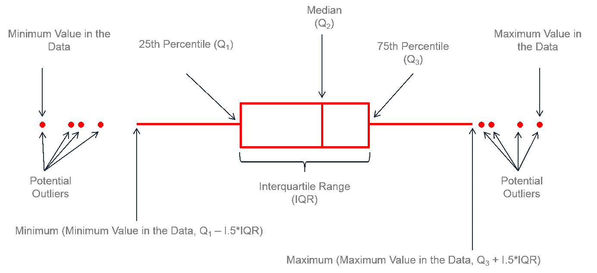

# Deskriptive Statistik für metrische Daten {#deskriptiv-metrisch}


## 📢 Zielsetzung dieser Einheit {.unnumbered}

Diese Einheit widmet sich der **Beschreibung metrischer Variablen**. Anhand des Beispiels von COVID-19 Erkrankungen in österreichischen Bezirken werden wir

+ die numerische Ermittlung klassischer **Lage- und Streuungsparameter** behandeln;
+ einen Exkurs zur Frage der **Normierung** von Daten unternehmen;
+ die Möglichkeiten der **graphischen Darstellung** von Lageparametern und der Variablen innewohnenden Streuung behandeln;
+ abschließend einen **Ausblick auf bivariate Zusammenhänge** zwischen metrischen Variablen werfen.

```{r echo=FALSE, purl=FALSE}
myScriptname <- "09_deskriptive_statistik_metrisch"

knitr::asis_output(paste(
  "<p><strong>tl;dr: </strong>",
  "<a href=\"https://kamihoeferl.at/lehre/vu_sozwiss_1/",
  myScriptname,
  ".R\" type=\"application/octet-stream\">Her mit dem Code!</a></p>",
  sep = ""))
```

------------------------------------------------------------------------


## Die Ausgangslage {#ausgangDeskriptivMetrisch}

Wie bei den kategorialen wollen wir uns nun den Möglichkeiten zur Beschreibung metrischer Daten widmen. Dazu werden wir folgendes Beispiel nutzen:

Die [Österreichische Agentur für Gesundheit und Ernährungssicherheit AGE](https://www.ages.at/startseite/) bietet tagesaktuell Informationen zur [COVID-19 Fällen in den politischen Bezirken Österreichs](https://www.data.gv.at/katalog/dataset/2f6649b6-2b2d-49a9-ab31-6c7e43728001) an. Wir wollen diese Daten nutzen, um

1.  herauszufinden, wie unterschiedlich sich **COVID-19 Erkrankungen** (gesamt und in den letzten sieben Tagen - Variablen Anzahl und AnzahlFaelle7Tage) und **Todesfälle** (Variable AnzahlTot) **auf die Bezirke und Bundesländer verteilen**;

2.  herauszufinden, ob es auf Eben der Bezirke zwischen der Anzahl der **COVID-19 Erkrankungen** (Variable Anzahl) und **Todesfälle** (Variable AnzahlTot) einen **Zusammenhang** gibt.

**Ein praktischer Hinweis:**\
Um diese Einheit auch zu einem späteren Zeitpunkt nachvollziehen zu können, werden nicht die tagesaktuellen Daten der AGES genutzt. Stattdessen wurden diese Daten zum Stichtag 25.05.2021 bezogen und als CSV-Datensatz abgelegt.

👉 Diese Stichtagsdaten können [**hier als CSV-Datei heruntergeladen**](data/agesRohdaten_25-05-21.csv) werden.

## Der Datenimport, die Datenaufbereitung und -validierung

Zur Vorbereitung der weiteren Analyse laden wir zunächst die [Packages tidyverse](https://www.tidyverse.org) (ggplot, dplyr etc.) und [scales](https://cran.r-project.org/web/packages/scales/index.html) (zur Formatierung von Achsen bei Abbildungen):

```{r message=FALSE}
library(tidyverse)
library(scales)
```

Dann holen wir uns die Stichtagsdaten und werfen einen Blick auf ihre Struktur:

```{r}
agesRohdaten <- read.csv2("data/agesRohdaten_25-05-21.csv", encoding = "UTF-8") %>%
  as_tibble()
str(agesRohdaten)
```

Sicherheitshalber halten wir noch nach möglichen "Löchern" (aka NAs) in den Daten Ausschau:

```{r}
colSums(is.na(agesRohdaten)) %>%
  knitr::kable()
```

Sehr gut, wir haben also keine Löcher in unserem Datensatz.

Bevor wir in die eigentliche Analyse einsteigen, wollen wir noch folgende **zwei Schritte** setzen:

1.  Um die COVID-19 Zahlen der Bundesländern vergleichen zu können, müssen wir die **Bezirke** ebendiesen zuordnen.
2.  Um eine Vergleichbarkeit der COVID-19 Erkrankungen zwischen den Bezirken herbeizuführen, **normieren** wir die Angaben zu den Erkrankungen (in den letzten sieben Tagen) und Verstorbenen auf 100.000 Einwohner.

Für die **Zuordnung der Bezirke zu ihrem Bundesland** werfen wir einen Blick auf die Logik der Vergabe von Kennziffern (Variable GKZ) für Bezirke in Österreich:

[http://statistik.at/web_de/klassifikationen/regionale_gliederungen/politische_bezirke](http://statistik.at/web_de/klassifikationen/regionale_gliederungen/politische_bezirke/index.html){.uri}

Wir wissen jetzt also, dass die **erste Stelle der Variable GKZ** als Index für die Liste der alphabetisch aufsteigend sortierten Bundesländernamen dient. Daher können wir folgendes machen:

```{r}
covidCases <- agesRohdaten %>%
  mutate(bula = factor(floor(GKZ/100),
                       levels = c(1:9),
                       labels = c("Burgenland",
                                  "Kärnten",
                                  "Niederösterreich",
                                  "Oberösterreich",
                                  "Salzburg",
                                  "Steiermark",
                                  "Tirol",
                                  "Vorarlberg",
                                  "Wien")
                       )
         )
summary(covidCases$bula)
```

Zuletzt noch das **Normieren** der Variablen Anzahl, AnzahlTot und Anzahl7Tage auf 100.000 Einwohner:

```{r}
covidCases <- covidCases %>%
  mutate(Anzahl_100k = Anzahl/(AnzEinwohner/100000),
         AnzahlTot_100k = AnzahlTot/(AnzEinwohner/100000),
         Anzahl7Tage_100k = AnzahlFaelle7Tage/(AnzEinwohner/100000))
```

Sehr gut, nun wollen wir die am Beginn gestellten Fragen mithilfe dieser Daten beantworten.

## Ein Blick auf klassische Lage- und Streuungsparameter

Um einen raschen Überblick auf (nicht nur) die bekanntesten Lageparameter wie das arithmetische Mittel und Streuungsparamter zu erhalten, schreiben wir:

```{r}
summary(covidCases)
```

Schnell und einfach, jedoch auch ohne eine oftmals inhaltlich erwünschte **Gruppierung der Variablen** von Interesse. Solche Gruppierungen werden beispielsweise gerne für regionale Vergleiche genutzt. Interessieren wir uns beispielsweise für die durchschnittliche Anzahl der COVID-19 Erkrankungen innerhalb der letzten sieben Tage in den Bezirken, werden wir hiermit zunächst glücklich:

```{r}
covidCases %>%
  summarise(avg_Faelle7tage = mean(Anzahl7Tage_100k))
```

Wenn wir diesen **Durchschnitt für mehrere Variablen** gleichzeitig ermittel wollen:

```{r}
covidCases %>%
  summarise(across(Anzahl_100k:Anzahl7Tage_100k, mean)) %>%
  knitr::kable(digits = 1)
```

Wie treffsicher diese bundesweiten Durchschnitte das regionale COVID-19 Infektionsgeschehen wiedergeben, zeigen uns die auf **Ebene der Bundesländer** ermittelten Durchschnittswerte:

```{r}
covidCases %>%
  group_by(bula) %>%
  summarise(across(Anzahl_100k:Anzahl7Tage_100k, mean)) %>%
  knitr::kable(digits = 1)
```

Im Vergleich der Bundesländer zeigen sich klare Unterschiede: Beispielsweise weisen zum Stichtag Tirol und Vorarlberg die geringsten Todesfälle je 100.000 Einwohner aber auch die höchsten Neuerkrankungen je 100.000 Einwohner in den letzten sieben Tagen auf.

Ein Blick auf die Mediane im Vergleich zu den arithmetischen Mitteln erlaubt uns einen ersten Eindruck der den Variablen innewohnenden Streuung:

```{r}
covidCases %>%
  group_by(bula) %>%
  summarise(across(Anzahl_100k:Anzahl7Tage_100k, median)) %>%
  knitr::kable(digits = 1)
```

Die vorhandenen Unterschiede zwischen den Medianen und den Mittelwerten deuten auf das **Vorhandensein von Ausreißern** hin. Mehr dazu später.

> 📚 **Exkurs zum Thema "Warum normieren?":**\
> Wer sich fragen sollte, warum wir das CORONA-19 Infektionsgeschehen auf 100.000 Einwohner normiert haben: Watch this!

```{r}
covidCases %>%
  group_by(bula) %>%
  summarise(avg_Anzahl_100k = mean(Anzahl_100k),
            avg_Anzahl = mean(Anzahl),
            avg_AnzahlTot_100k = mean(AnzahlTot_100k),
            avg_AnzahlTot = mean(AnzahlTot)) %>%
  knitr::kable(digits = 1)
```

> Der direkte Vergleich zeigt, dass die in den nicht-normierte Daten enthaltenen **Größeneffekte** klare die Ranggreihenfolge der Bezirke beeinflussen. Natürlich gilt: Nicht für alle Fragestellungen ist eine Normierung von Daten nötig oder gar erwünscht. Die Entscheidung für oder gegen einer solche Normierung kann damit immer nur in Hinblick auf die zu beantwortende Frage getroffen werden.


## Exkurs für motivierte GeographInnen: Räumlich explizite Deskription

Für GeographInnen spielt ja auch die Frage nach dem "Wo?" oftmals eine große Rolle. In unserem Fall würde sich beispielsweise die räumliche Verteilung der COVID-19 Erkrankungen anbieten, in einer Karte verewigt zu werden. Um dies zu bewerkstelligen müssen wir

* die **Geometrien der Österreichischen Bezirke** als SHP-Dateien vorliegen haben;
* an diese Geometrien unsere **COVID-19 Daten anhängen (aka "joinen")** und
* letztlich daraus eine einfache **thematische Karte** basteln.

Da sich all dies in R leicht umsetzen lässt:

**1. Die Geometrien der österreichischen Bezirke:**

Werden uns zum Stand 2021 von der Statistik Austria unter folgender Adresse angeboten:

https://www.data.gv.at/katalog/dataset/stat_gliederung-osterreichs-in-politische-bezirke131e2/resource/d2659aca-306f-4e24-a318-bf9cfb32319f

Ich habe mir erlaubt, diesen Datensatz etwas aufzubereiten (vgl. [VU "How 2 do Things with even more Numbers"](https://kamihoeferl.at/lehre/vu_sozwiss_2/05_multireg_I.html) aus dem WS 21-22). Er kann 👉 [HIER als ZIP-Archiv gealden werden](data/bez/bez.zip).

> **👉 Anmerkung**: Wir gehen in dieser Einheit von folgender Verzeichnisstruktur aus:

    **Projektfolder**
    | skript_1.R
    | ...
    | skript_n.R    
    +-- data
    |     bez
    |       | geodatensatz_1.xyz
    |       | ...
    |       | geodatensatz_n.xyz
    |     | datensatz_1.xyz
    |     | ...
    |     | datensatz_n.xyz
    +-- output
    
Mittels des [Simple Features (sf) Packages](https://cran.r-project.org/web/packages/sf/index.html) können wir gängige Geodatenformate (zB SHP-Dateien) in R gelesen und beispielsweise über das [Thematic Maps (tmap) Package](https://cran.r-project.org/web/packages/tmap/index.html) visualisieren:

```{r fig.width=9, fig.height=4.75}
library(sf)
library(tmap)
bez <- read_sf("data/bez/bez_aut.shp")
tm_shape(bez) +
  tm_polygons()
```

**2. Verknüpfung der Attribut- mit den Geometriedaten:**

Jetzt müssen wir nur noch unsere **Attributdaten** - die Variablen zum COVID-19 Infektionsgeschehen aus dem covidCases-Tibble - an die Geometrien der Bezirke hängen. Wie aus der Geoinformatik bekannt, verwenden wir dazu einen **Join** (konkret: die [left_join Funktion](https://dplyr.tidyverse.org/reference/mutate-joins.html) des [dplyr Packages](https://dplyr.tidyverse.org/)):

```{r}
joined_bez <- left_join(bez, covidCases, by = c("id" = "GKZ"))
```

**3. Visualisierung ausgewählter Variablen als Choroplethenkarte:**

Damit können wir nun eine einfache [Choroplethenkarte](https://de.wikipedia.org/wiki/Choroplethenkarte) zu den COVID-19 Infektionen je 100.000 Einwohner in den österreichischen Bezirken erstellen:

```{r fig.width=9, fig.height=4.75}
tmap::qtm(joined_bez, fill = "Anzahl_100k")
```

Und wer das gerne noch mit etwas mehr 🚀 🎉 möchte:

```{r fig.width=9, fig.height=3.75}
mymap <- tm_shape(joined_bez) +
  tm_polygons("Anzahl_100k",
              title = "Erkrankte\nje 100.00 EW",
              palette = "YlOrRd",
              legend.hist = TRUE) +
  tm_scale_bar(position = c("left", "bottom")) +
  tm_legend(outside = TRUE,
            legend.outside.size = 0.15,
            hist.width = 1,
            outer.margins = 0)
mymap
```

Zum Abschluß dieses Exkurses: Wie kann ich solche **Karten speichern** (zB in den Ordner "output")?

```{r message=FALSE, warning=FALSE}
tmap_save(mymap, filename = "output/covid_faelle_100k_2021.png",
          units = "px", dpi = 300,
          width = 2000)
```

## Lage- und Streuungsparameter graphisch darstellen

Um einen schnellen Überblick auf die Daten innewohnende Streuung (= Verteilung der beobachteten Werte) zu erhalten, bieten sich zwei klassische Darstellungsformen an:

-   [Histogramme](https://de.wikipedia.org/wiki/Histogramm) und

-   [Boxplots](https://de.wikipedia.org/wiki/Box-Plot)

### **Histogramme**

Anhand von Klassen ("bins") wird die **Häufigkeitsverteilung der beobachteten Werte** dargestellt:

```{r}
ggplot(covidCases, aes(x = Anzahl7Tage_100k)) +
  geom_histogram(bins = 50,
                 col = "black", fill = "red")
```

In unserem Fall der COVID-19 Erkrankungen in den letzten 7 Tagen sehen wir, dass nur sehr wenige Bezirke mehr als 90 Erkrankungen je 100.000 Einwohner hatten. **Wer diese "Ausreißer nach oben" waren**, lässt sich mit einer einfachen Filterung herausfinden:

```{r}
covidCases %>%
  select(Bezirk, Anzahl7Tage_100k) %>%
  filter(Anzahl7Tage_100k >= 90) %>%
  arrange(-Anzahl7Tage_100k)
```

Da wir ja bereits die Vermutung haben, dass diese Verteilung in den Bundesländern unterschiedlich ausfallen könnte, lassen wir uns je Bundesland ein solches Histogramm erstellen:

```{r warning=FALSE}
ggplot(covidCases, aes(x = Anzahl7Tage_100k)) +
  geom_histogram(bins = 30, fill = "red", color = "black") +
  # geom_density(size = 1, color = "red") +
  facet_wrap(~bula)
```

Betrachtet man die beiden Bundesländer mit den meisten Bezirken, so zeigt sich dass in Niederösterreich am stärksten besetzten Klassen unter und in Oberösterreich über 50 Erkrankungen je 100.000 Einwohner in den letzten sieben Tagen lagen.

> 📚 **Exkurs:**\
> Histogramme werden gerne auch zur Abschätzung der **Normalverteilung** einer Variable genutzt. Warum das? Für manche Testverfahren ist es wichtig zu wissen, ob die darin verwendeten Variablen normalverteilt sind oder nicht. Mehr dazu aber in einer der späteren Einheiten. Um diese Abschätzung zu unterstützen, kann die beobachtete **Dichtefunktion** eingeblendet werden:

```{r warning=FALSE}
ggplot(covidCases, aes(x = Anzahl7Tage_100k, y = ..density..)) +
  geom_histogram(bins = 50,
                 col = "black", fill = "red") +
  geom_rug(aes(x = Anzahl7Tage_100k, y = NULL)) +
  geom_density(size = 1.5)
```

> In unserem Fall spricht der rechte "tail" der beobachteten Dichtefunktion eher gegen eine Normalverteilung der CORONA-19 Erkrankungen je 100.000 Einwohner in den letzten sieben Tagen.

### **Boxplots**

Boxplots ermöglichen zwar nicht die Beurteilung der Normalverteilung einer Variable, bieten aber einen sehr kompakten Überblick auf den **Median** und ausgewählte **quartilsbasierte Streuungsparameter**:

```{r echo = FALSE, fig.cap="Struktur von Boxplots in R (Quelle: [Coleman, 2020](https://www.leansigmacorporation.com/box-plot-with-minitab/))"}

```

Insbesondere die Identifikation von Ausreißern, also einzelnen Extremwerten wird durch Boxplots sehr erleichtert:

```{r}
ggplot(covidCases, aes(x = bula, y = AnzahlTot_100k)) +
  geom_boxplot()
```

Das geht natürlich auch wieder a little bit more shiny:

```{r message=FALSE, warning=FALSE}
ggplot(covidCases, aes(x = forcats::fct_reorder(bula, AnzahlTot_100k, median), y = AnzahlTot_100k)) +
  geom_boxplot(fill = "azure3") +
  geom_jitter(shape=16, position=position_jitter(0.1),
              color = "red", alpha = 0.2) +
  theme_bw() +
  theme(plot.title = element_text(face = "bold", hjust = 0.5),
        plot.caption = element_text(hjust = 0.5),
        axis.text.x=element_text(angle = 45, hjust = 1),
        axis.title.x = element_text(face = "bold"),
        axis.title.y = element_text(face = "bold")) +
  labs(title = "Verteilung der COVID-19 Todesfälle\n",
       x = "\nBundesländer",
       y = "COVID-19 Todesfälle\nje 100.000 EW\n",
       caption = "\nDaten: AGES, 2021 - covid19-dashboard@ages.at")
```

## Ein erster Blick auf mögliche Zusammenhänge

Für explorative Zugänge ist es oftmals inhaltlich zielführend, mehrere Variablen graphisch zueinander in Beziehung zu setzen. Beispielsweise könnten wir uns fragen, ob wir zwischen der Einwohnerzahl der Bezirke, deren Bundeslandzugehörigkeit, und den COVID-19 Erkrankungen sowie Verstorbenen einen Zusammenhang gibt. Dabei filtern wir den politischen Bezirk Wien aus, um die Verteilung der restlichen Bezirke besser studieren zu können:

```{r message=FALSE, warning=FALSE}
covidCasesNoVIE <- covidCases %>%
  filter(GKZ != 900)

ggplot(covidCasesNoVIE, aes(x = AnzEinwohner, y = Anzahl, fill = bula)) +
  geom_point(aes(size = AnzahlTot), shape=21) +
  scale_x_continuous(labels = scales::label_comma(big.mark = "."), breaks = scales::breaks_extended(6)) +
  scale_y_continuous(labels = scales::label_comma(big.mark = ".")) +
  theme_bw() +
  theme(text = element_text(size = 14),
        plot.title = element_text(hjust = 0.5),
        plot.caption = element_text(hjust = 0.5),
        axis.text.x=element_text(angle = 45, hjust = 1)) +
  labs(title = "Polit. Bezirke nach Einwohnern,\nCOVID-19 Fällen und Verstorbenen\n",
       x = "\nEinwohner",
       y = "COVID-19 Fälle\n",
       caption = "\nDaten: AGES, 2021 - covid19-dashboard@ages.at",
       size = "Anzahl Verstorbene",
       fill = "Bundesland") +
  guides(fill = guide_legend(override.aes = list(size = 5)))
```

> 📚 **Exkurs zum Thema Datenpunkte beschriften:**\
> Gerade bei Scatterplots ist die Beschriftung einzelner Datenpunkte zentral, um schnell Informationen über Extremwerte zu erhalten. In unserem Fall bietet sich für eine solche Beschriftung der **Name des Bezirks (Name)** an:

```{r warning=FALSE}
ggplot(covidCasesNoVIE, aes(x = AnzEinwohner, y = Anzahl, fill = bula)) +
  geom_point(aes(size = AnzahlTot), shape=21) +
  geom_text(aes(label = Bezirk)) +
  scale_x_continuous(labels = scales::label_comma(big.mark = "."), breaks = scales::breaks_extended(6)) +
  scale_y_continuous(labels = scales::label_comma(big.mark = ".")) +
  theme_bw() +
  theme(text = element_text(size = 14),
        plot.title = element_text(hjust = 0.5),
        plot.caption = element_text(hjust = 0.5),
        axis.text.x=element_text(angle = 45, hjust = 1)) +
  labs(title = "Polit. Bezirke nach Einwohnern,\nCOVID-19 Fällen und Verstorbenen\n",
       x = "\nEinwohner",
       y = "COVID-19 Fälle\n",
       caption = "\nDaten: AGES, 2021 - covid19-dashboard@ages.at",
       size = "Anzahl Verstorbene",
       fill = "Bundesland") +
  guides(fill = guide_legend(override.aes = list(size = 5)))
```

> Ja, damit hätten wir Beschriftungen eingefügt, aber nein: Alle Datenpunkte zu beschriften trägt nicht dazu bei, die Lesbarkeit des Diagramms zu verbessern. Hier kann das [Package ggrepel](https://cran.r-project.org/web/packages/ggrepel/vignettes/ggrepel.html) helfen, indem es überlappende Beschriftungen vermeidet:

```{r warning=FALSE}
library(ggrepel)
ggplot(covidCasesNoVIE, aes(x = AnzEinwohner, y = Anzahl, fill = bula)) +
  geom_point(aes(size = AnzahlTot), shape=21) +
  geom_text_repel(aes(label = Bezirk),
                  size = 3,
                  color = "gray",
                  # point.padding = 5,
                  box.padding = 0.4,
                  min.segment.length = 1) +
  scale_x_continuous(labels = scales::label_comma(big.mark = "."), breaks = scales::breaks_extended(7)) +
  scale_y_continuous(labels = scales::label_comma(big.mark = ".")) +
  theme_bw() +
  theme(text = element_text(size = 14),
        plot.title = element_text(hjust = 0.5),
        plot.caption = element_text(hjust = 0.5),
        axis.text.x=element_text(angle = 45, hjust = 1)) +
  labs(title = "Polit. Bezirke nach Einwohnern,\nCOVID-19 Fällen und Verstorbenen\n",
       x = "\nEinwohner",
       y = "COVID-19 Fälle\n",
       caption = "\nDaten: AGES, 2021 - covid19-dashboard@ages.at",
       size = "Anzahl Verstorbene",
       fill = "Bundesland") +
  guides(fill = guide_legend(override.aes = list(size = 5)))
```

------------------------------------------------------------------------

🏆 **Nun wissen wir, ...**

- dass wir **selten "perfekte" Sekundärdaten** vorfinden, die keine vorbereitenden Datenmanipulationen erfordern;
- dass **numerische Lage- und Streuungsparameter** flott mittels mean, median, std etc. ermittelt werden können;
- dass wir über eine **Normierung von Daten** Größeneffekte bei Vergleichen zwischen Merkmalsträgern vermeiden können;
- dass eine ansprechende **graphische Deskription** metrischer Variablen oftmals etwas Feintuning erfordert;
- dass **Scatterplots** eine beliebte Möglichkeit sind, mögliche **Zusammenhänge** zwischen metrischen Variablen graphisch zu erkunden.

Wie im Fall der kategorialen Variablen bleibt aber die Fragen, ob wir **Zusammenhänge zwischen metrischen Variablen** nicht auch numerisch beschreiben können.

{.videoframe width="250"}
