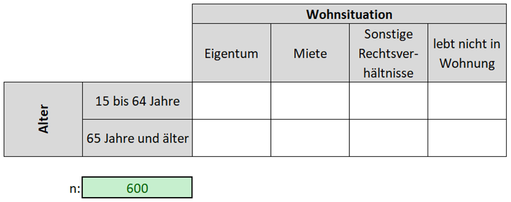

# \@Home2: Eine einfache Quotenstichprobe

## 📢 Zielsetzung {.unnumbered}

Ziel dieser Aufgabe ist es, selbständig a) eine Quotenstichprobe zu ziehen und b) die dazu notwendigen Arbeitsschritte in einem Kurzbericht zu dokumentieren.

------------------------------------------------------------------------

## Ausgangslage

Sie wollen Innsbrucker Bürgerinnen und Bürger zu deren **Wohnzufriedenheit** befragen. Die Stichprobenziehung soll dabei als **informative Quotenauswahl** erfolgen.

## Aufgabenstellung

Erstellen Sie dazu eine Quotenauswahl nach Altersklassen und Wohnsituation mit einem Stichprobenumfang von n = 600.

## Formelles

-   je 2er-Gruppe: Erstellen Sie einen **Kurzbericht** (A4 -- PDF):

    -   Rekapitulation Aufgabenstellung

    -   Datenbeschaffung & -dokumentation

    -   Arbeitsablauf

    -   Kritische Würdigung Daten & Ablauf

    -   Quotenstichprobe

-   Benennung: **Gruppe_XY\_\@Home2.pdf**

-   Abgabe via **OLAT** - Ordner "Abgabe \@Home2"

-   Deadline: **13.05.22 / 23.59 Uhr**

------------------------------------------------------------------------

**🤔 Challange accepted?**

{.videoframe width="250"}
