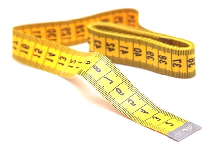

<div style="margin-bottom:50px;"></div>
 
```{r messen2, echo=FALSE, out.width="400px", fig.align = "center"}

```

<div style="margin-bottom:50px;"></div>

# Howdy {-}

In diesem WorkBook werden Materialien zur **VU "Sozialwiss. Methoden – How 2 do Things with Numbers" (716408)** aus dem **SS 2022** angeboten. Diese VU richtet sich an Personen, die 

* ihre Fertigkeiten zur Erhebung quantitativer Daten auffrischen wollen;
* und grundlegende Möglichkeiten zur Auswertung quantitativer Daten mittels R und RStudio kennenlernen wollen.

Sounds good?

{.videoframe width="250"}

Let's roll ...

---

[](https://creativecommons.org/licenses/by/4.0/deed.de)

Dieses WorkBook und alle darüber angebotenen Materialien (Code, Daten etc.) stehen – so nicht ausdrücklich anders angegeben – unter einer [CC BY 4.0](https://creativecommons.org/licenses/by/4.0/deed.de) Lizenz.
